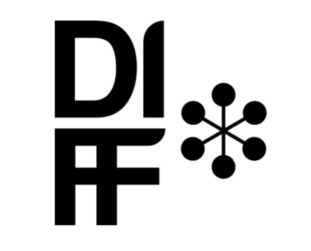
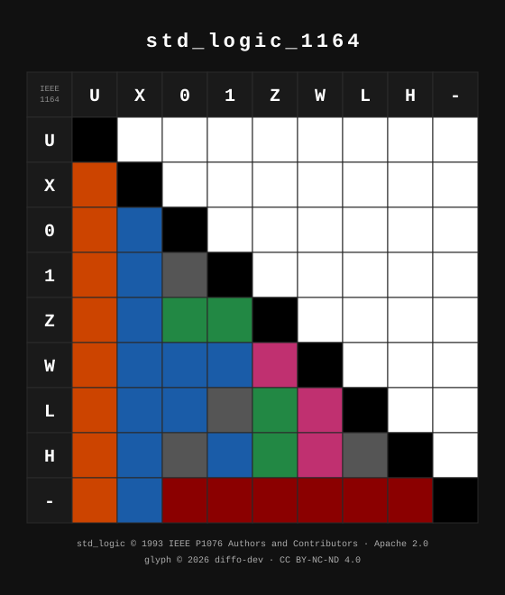
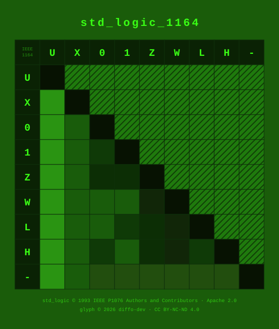
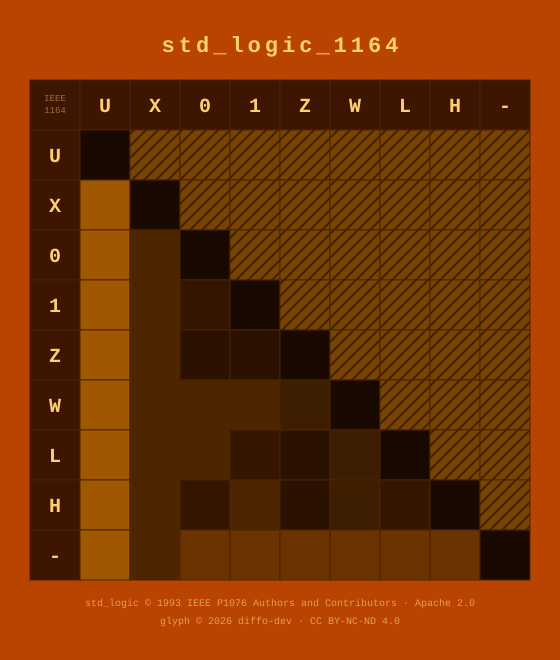
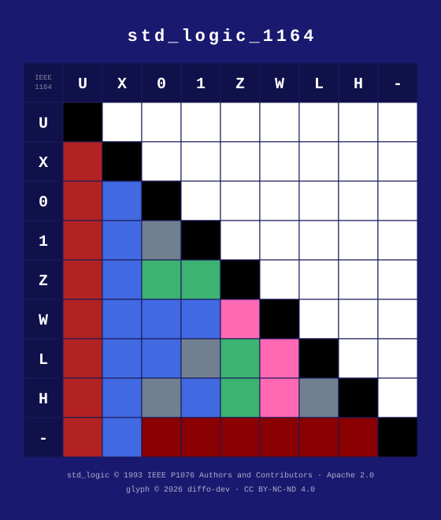

# Ieee1164

Diffo.IEEE1164 is about knowledge about IEEE1164.

IEEE1164 is a building block in our digital universe. Without it we wouldn't know the chemistry of advanced communications, devices, cloud, AI and the like.

## Diffo

Diffo is about knowledge about knowledge. We are knowing about Autonomous Systems and Ethical Agency.



## Journey to the land of IEEE1164

Knowledge is relational. So we'll yarn with the ancestor of IEEE1164 and see where the journey takes us.

The journey starts in 1993, but the wisdom is much older.

### Livebook

An elixir livebook is the easiest way to get started. You download the Livebook application, it runs a sandbox in your browser which runs our code.

** livebook **

### Installation

You can install as below

If [available in Hex](https://hex.pm/docs/publish), the package can be installed
by adding `ieee1164` to your list of dependencies in `mix.exs`:

```elixir
def deps do
  [
    {:ieee1164, "~> 0.1.0"}
  ]
end
```

### Celebrate Your Journey

Choose an glyph memorializing when you started knowing std_logic_1164, or just pick your favourite geek ascetic.

<details>
  <summary>Dark Mode</summary>
  
</details>

<details>
  <summary>Green Phosphor</summary>
  
</details>

<details>
  <summary>Hercules</summary>
  
</details>

<details>
  <summary>X11</summary>
  
</details>

### Next Steps on the Journey

Maybe you've wondered why we haven't put the std_logic resolved values on the glyph? And why the glyph explains its ancestory but little else?

Maybe you understand the glyph after listening to the IEEE1164's story and can now do it yourself. That is real knowledge about knowledge. The glyph honours IEEE1164 and is true to what we are and do at diffo.

Find out more at [diffo-dev](https://github.com/diffo-dev) 


## Notice

License notices for code and images separately see [NOTICE](NOTICE)

## Acknowledgements

Diffo IEEE1164 is new, but the ideas are not. At diffo-dev we are on a journey inspired by Indigenous Systems Thinking and offer our respect and gratitude for the profound wisdom presented by Tyson Yunkaporta in Sand Talk, grounded in countless years of sustainable, harmonious living.

Documentation can be generated with [ExDoc](https://github.com/elixir-lang/ex_doc)
and published on [HexDocs](https://hexdocs.pm). Once published, the docs can
be found at <https://hexdocs.pm/ieee1164>.


